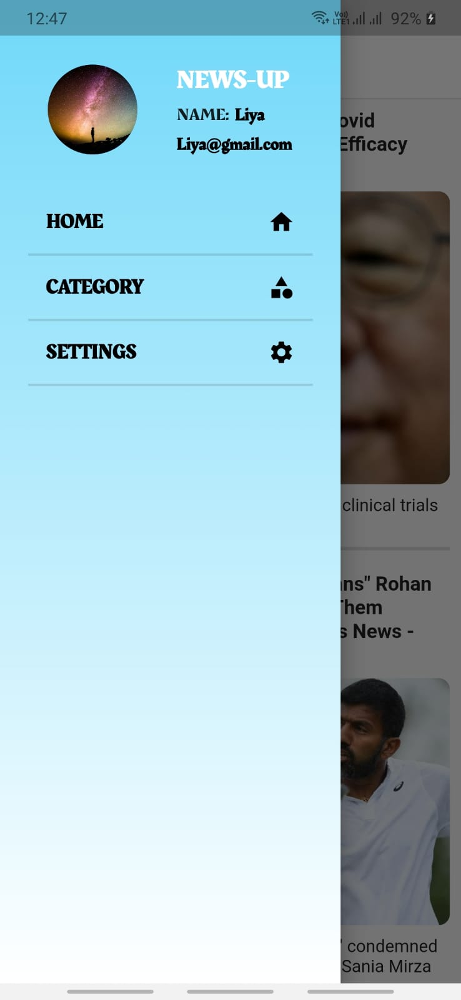
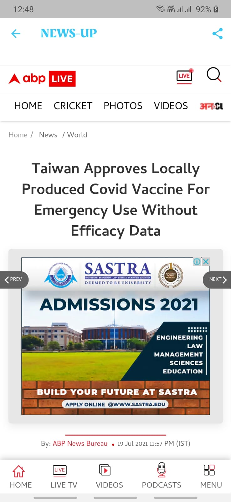

# News-Up(APP)

This Project is on News-Up known as News APP , made by using FLutter and Dart and with features such as webviewing the news , Sharing the new , Seeing the Categorical News.

## Screenshots

### HOME

### CATEGORIES

#### PART1

#### PART2

### SIDEBAR

### CATEGORY VIEW

### WEBVIEW

## Getting Started

This project is a starting point for a Flutter application.

A few resources to get you started if this is your first Flutter project:

- [Lab: Write your first Flutter app](https://flutter.dev/docs/get-started/codelab)
- [Cookbook: Useful Flutter samples](https://flutter.dev/docs/cookbook)

For help getting started with Flutter, view our
[online documentation](https://flutter.dev/docs), which offers tutorials,
samples, guidance on mobile development, and a full API reference.
